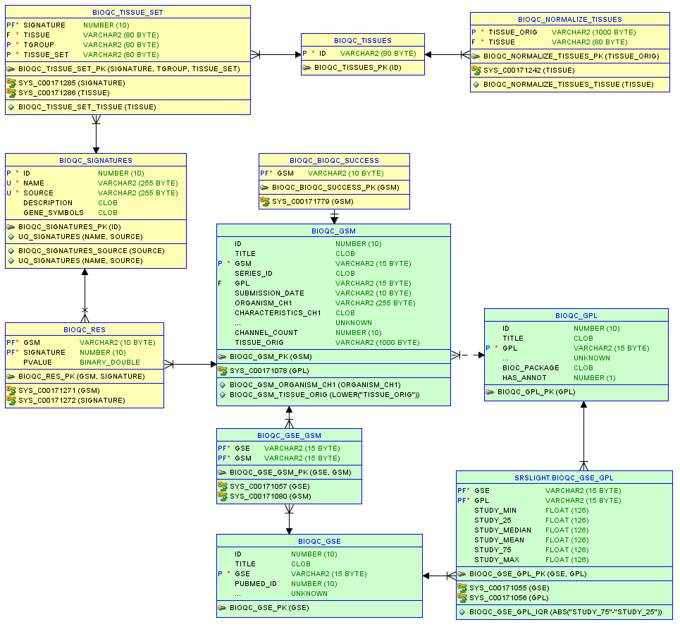

# Setup Database


We store meta information for GEO samples and BioQC results in 
an Oracle 11g database. We combine the metadata from [GEOmetadb](https://www.bioconductor.org/packages/release/bioc/vignettes/GEOmetadb/inst/doc/GEOmetadb.html)
with tables to store signature scores generated with 
[BioQC](https://accio.github.io/BioQC) and manually curated annotations. 

[GEOmetadb](https://www.bioconductor.org/packages/release/bioc/vignettes/GEOmetadb/inst/doc/GEOmetadb.html) 
is an SQLite database containing metadata associated with samples and studies from GEO. 

<div class="figure" style="text-align: center">

<p class="caption">(\#fig:unnamed-chunk-2)Entitiy relationship diagram of the *BioQC* database scheme. Click the [here](https://github.com/grst/BioQC_GEO_analysis/raw/master/db/design/er_diagram.pdf) for an enlarged version. Greenish tables are imported from GEOmetadb. Yellowish tables are additional tables designed for this study. Three dots (...) indicate columns from GEOmetadb which are omitted in the visualisation because they are not relevant for this study.</p>
</div>

## Tables explained

### GEOmetadb
* **BIOQC_GSM**: *from GEOmetadb*, meta information for all *Samples* in GEO
* **BIOQC_GPL**: *from GEOmetadb*, list of all platforms (*e.g.* different types of microarrays) referenced in GEO. 
* **BIOQC_GSE**: *from GEOmetadb*, list of *Series* (collections of samples) in GEO. 

### Tissue Annotation
The annotation of tissues is inconsistent within GEO. A "liver" sample can be termed *e.g.* "liver", "liver biopsy" or "primary liver". We therefore need a way to "normalize" the tissue name. We did this manually for the most abundant tissues in this [Excel sheet](https://github.com/grst/BioQC_GEO_analysis/blob/master/manual_annotation/normalize_tissues.xlsx) which is then imported into the **BIOQC_NORMALIZE_TISSUES** table. **BIOQC_TISSUES** is simply a unique list of all curated tissues. 

### Signatures
Signatures are essentially a list of genes, which are over-represented in a certain tissue, cell type, pathway, etc. A common way to save such signatures is the [GMT file format](http://software.broadinstitute.org/cancer/software/gsea/wiki/index.php/Data_formats#GMT:_Gene_Matrix_Transposed_file_format_.28.2A.gmt.29). These GMT files can be imported into **BIOQC_SIGNATURES**. 

### Expected Signatures
In order to find out which samples are 'contamined' by other tissues, we first need to define which signatures we would 'expect' in a certain tissue. We therefore manually mapped signatures to the respective tissue type in this 
[Excel sheet](https://github.com/grst/BioQC_GEO_analysis/blob/master/manual_annotation/tissue_sets.xlsx). For example, we map the signatures `Intestine_Colon_cecum_NR_0.7_3` and `Intestine_Colon_NR_0.7_3` to *colon*.  

Moreover, we ran into the issue, that some tissue signatures are not as specific as the annotation in the GEO. We therefore curated so-called *tissue sets*. For example, it is hard to distinguish *jejunum* from *colon*, but easy to distinguish the two from other tissues. We therefore created a tissue set *intestine*, which contains both *jejunum* and *colon* and references all signatures associated with the two tissues. This information is part of the same [Excel sheet](https://github.com/grst/BioQC_GEO_analysis/blob/master/manual_annotation/tissue_sets.xlsx) which we imported into  **BIOQC_TISSUE_SET**. 

### Results
Our analysis creates a p-value for each sample in `BIOQC_GSM` and each signature in `BIOQC_SIGNATURES`. These p-values are stored in **BIOQC_RES**.


## Import GEOmetadb

First, we need to extract a list of tables:  

```r
gdb = dbConnect(SQLite(), file.path(DATA_DIR, "geometabase/GEOmetadb.sqlite"))
tables = dbListTables(gdb)
writeLines(tables, file(file.path(DATA_DIR, "geometabase/tables.txt")))
```

Then, we use a [conversion script](https://github.com/grst/BioQC_GEO_analysis/blob/master/db/geometadb2csv.sh) to 
export the SQL schema and the tables as csv, which can be easily imported into the Oracle DBS. 

We adjusted the [GEOmetadb schema](https://github.com/grst/BioQC_GEO_analysis/blob/master/db/geometadb_schema.sql) to match 
Oracle datatypes. 

Once the tables are imported, we check if all the tables have the same number of rows: 

```r
# check for consistency 
for(table in tables) {
  count.query = sprintf("select count(*) from %s", table)
  count.query.ora = sprintf("select count(*) from bioqc_%s", table)
  print(count.query)
  expect_equal(dbGetQuery(gdb, count.query)[[1]], dbGetQuery(mydb, tolower(count.query.ora))[[1]])
}
```


### Fix foreign key constraints

Unfortunately, foreign key constraints are not enabled in the GEOmetadb SQLite database. It turned out that the GEOmetadb is not entirely consistent when trying to add such constraints in Oracle. We fixed missing 
parent keys by adding "stub" entries to the tables. The procedure is documented in 
[this SQL script](https://github.com/grst/BioQC_GEO_analysis/blob/master/db/update_geometabase.sql). 


### Extract Tissue annotation

The tissue annotation for each sample is hidden in the `characteristics_ch1` column of the `BIOQC_GSM` table. Since this information is 
essential for our study, we parsed it into a separate column using a regular expression. The procedure is documented in 
[this SQL script](https://github.com/grst/BioQC_GEO_analysis/blob/master/db/update_geometabase.sql). 


### Load annotation information

To run [BioQC](https://accio.github.io/BioQC), gene symbols need to be annotated in the gene expression matrix.
To retrieve gene symbols, we are aware of two feasible possibilities: 

* the Bioconductor annotation packages (listed in GEOmetadb `gpl.bioc_package`)
* use the GEO `annot_gpl` files ("in general available for all GSE that are referenced by a GDS"[^1]) 

[^1]: https://bioconductor.org/packages/release/bioc/manuals/GEOquery/man/GEOquery.pdf

To find out for which GSE in particular the latter option exists, we parsed the directory structure of the
GEO ftp server: 


```bash
lftp -c "open ftp://ftp.ncbi.nlm.nih.gov/geo/platforms/ && find && exit" > gpl_annot_ftp_tree.txt
grep annot.gz gpl_annot_ftp_tree.txt | cut -d"/" -f5 | cut -d"." -f1 > gpl_annot.txt
```

We add this information the the `BIOQC_GPL` table as a boolean flag indicating whether the respective
platform has an annotation file. 


```r
# tmp table
sql = "create table bioqc_gpl_annot(gpl varchar2(10) primary key, has_annot number(1))"
dbSendUpdate(mydb, sql)
annot = read.table("db/data/gpl_annot.txt")
annot = cbind(annot, rep(1, length(annot)))
colnames(annot) = c("1", "2")
dbAppendDf("BIOQC_GPL_ANNOT", annot)
# update gpl from tmp table
sqlUpdateGpl = "
  update bioqc_gpl g
  set has_annot = (select has_annot from bioqc_gpl_annot a
                     where g.gpl = a.gpl)"
dbSendUpdate(mydb, sqlUpdateGpl)
# drop tmp table
sql = "drop table bioqc_gpl_annot"
dbSendUpdate(mydb, sql)
```

We compared the two approaches in [Sample Selection](#sample-selection). 

## Import BioQC data
We install the BioQC schema using this [SQL script](https://github.com/grst/BioQC_GEO_analysis/blob/master/db/bioqc_schema.sql). 

### Signatures

Import signatures into the database and create a single, consolidated gmt file. Tissue signature relevant for this
study are `expr.tissuemark.affy.roche.symbols.gmt` and the `gtex` signatures. 

```r
download.file("http://bioinfo.bas.roche.com:8080/apps/gsea/genesets/exp.tissuemark.bioqc.roche.symbols.gmt",
              "data/expr.tissuemark.affy.roche.symbols.gmt")
gmt2db("data/expr.tissuemark.affy.roche.symbols.gmt")
gmt2db("../BioQC_correlated-pathways/go.bp.roche.symbols.gmt.uniq")
gmt2db("../BioQC_correlated-pathways/MetaBase.downstream.expression.gmt")
gmt2db("../BioQC_correlated-pathways/path.ronet.roche.symbols.gmt.ascii")
gmt2db("../gene-set-study/data/gtex/gtex_ngs_0.7_3.gmt")
gmt2db("../gene-set-study/data/gtex/gtex_ngs_0.85_5.gmt")
db2gmt("results/gmt_all.gmt")
```


### Tissue Annotation

Import the [manually curated tissues](https://github.com/grst/BioQC_GEO_analysis/blob/master/manual_annotation/normalize_tissues.xlsx) from Excel into the database. 

```r
normalized_tissues = data.table(read_excel("manual_annotation/nosrmalize_tissues.xlsx"))
tissues = unique(normalized_tissues[!is.na(TISSUE_NORMALIZED),"TISSUE_NORMALIZED", with=FALSE])
tab_normalized = normalized_tissues[!is.na(TISSUE_NORMALIZED),c("TISSUE", "TISSUE_NORMALIZED"), with=FALSE]

dbAppendDf("BIOQC_TISSUES", tissues)
dbAppendDf("BIOQC_NORMALIZE_TISSUES", tab_normalized)
```

### Tissue Sets

Import the [manually curated tissue sets](https://github.com/grst/BioQC_GEO_analysis/blob/master/manual_annotation/tissue_sets.xlsx) from Excel into the database. 

```r
bioqc_solid = read_excel("manual_annotation/tissue_sets.xlsx", sheet = 1)
gtex_solid = read_excel("manual_annotation/tissue_sets.xlsx", sheet=2)
gtex_all = read_excel("manual_annotation/tissue_sets.xlsx", sheet=3)

signatureset2db(bioqc_solid, "bioqc_solid")
signatureset2db(gtex_solid, "gtex_solid")
signatureset2db(gtex_all, "gtex_all")
```


