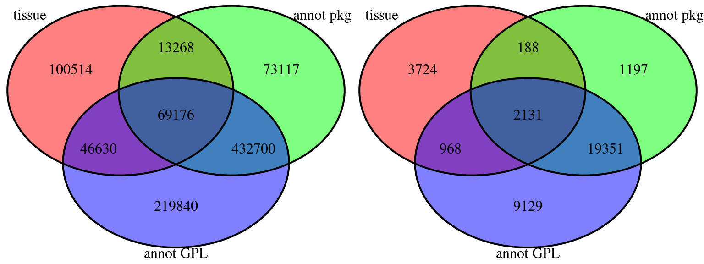

# Sample selection 


Here, we document the sample selection process. 

## Selecting samples that have the required annotation
A sample is usable for use, if 

* the gene symbos are annotated (requirement to run BioQC)
* the tissue of origin is annotated (requirment to draw conclusions about contamination)

We consider two approaches for annotating gene symbols: 

* Using the Bioconductor [AnnotationDbi](https://bioconductor.org/packages/release/bioc/html/AnnotationDbi.html) package. The GEOmetadb provides a mapping of the GPL identifier to these packages. 
* Using the `annotGPL=TRUE` option of [GEOquery](https://bioconductor.org/packages/release/bioc/html/GEOquery.html)'s `getGEO`. This requires an annotation file being available for the respective platform. We retrieved a list of the available annoataion files in an earlier step. 

We compare the two methods with respect to the amount of usable samples that we can get: 
 
Run sql script
`views/annotation_stats.sql`.
 

```r
# filtering stats for a table. 
sqlStats = "
select 'total', count(distinct gsm), count(distinct gse) from bioqc_studies_total
union select 'tissue', count(distinct gsm), count(distinct gse) from bioqc_studies_has_tissue
union select 'package', count(distinct gsm), count(distinct gse) from bioqc_studies_has_package
union select 'annotation', count(distinct gsm), count(distinct gse) from bioqc_studies_has_annot
union select 'tissue_package', count(distinct gsm), count(distinct gse) from (select * from bioqc_studies_has_tissue intersect select * from bioqc_studies_has_package) u1
union select 'annotation_package', count(distinct gsm), count(distinct gse) from (select * from bioqc_studies_has_annot intersect select * from bioqc_studies_has_package) u2
union select 'tissue_annotation', count(distinct gsm), count(distinct gse) from (select * from bioqc_studies_has_tissue intersect select * from bioqc_studies_has_annot) u3
union select 'annotation_tissue_package', count(distinct gsm), count(distinct gse) from (select * from bioqc_studies_has_tissue intersect select * from bioqc_studies_has_package intersect select * from bioqc_studies_has_annot) u4
"
stats = data.table(dbGetQuery(mydb, sqlStats))
colnames(stats) = c("rn", "GSM", "GSE")
setkey(stats,rn)

categories = c("tissue", "annot pkg", "annot GPL")
colors=c('red', 'green', 'blue')

plot.new()
gl = grid.layout(nrow=1, ncol=2)
vp.1 = viewport(layout.pos.col=1, layout.pos.row=1)
vp.2 = viewport(layout.pos.col=2, layout.pos.row=1)
pushViewport(viewport(layout=gl))
pushViewport(vp.1)

draw.triple.venn(stats[rn=='tissue',GSM], 
                 stats[rn=='package',GSM], 
                 stats[rn=='annotation',GSM], 
                 stats[rn=='tissue_package',GSM],
                 stats[rn=='annotation_package',GSM], 
                 stats[rn=='tissue_annotation',GSM], 
                 stats[rn=='annotation_tissue_package',GSM], category=categories, fill=colors)
```

```
## (polygon[GRID.polygon.11], polygon[GRID.polygon.12], polygon[GRID.polygon.13], polygon[GRID.polygon.14], polygon[GRID.polygon.15], polygon[GRID.polygon.16], text[GRID.text.17], text[GRID.text.18], text[GRID.text.19], text[GRID.text.20], text[GRID.text.21], text[GRID.text.22], text[GRID.text.23], text[GRID.text.24], text[GRID.text.25], text[GRID.text.26])
```

```r
popViewport()
pushViewport(vp.2)

draw.triple.venn(stats[rn=='tissue',GSE], 
                 stats[rn=='package',GSE], 
                 stats[rn=='annotation',GSE], 
                 stats[rn=='tissue_package',GSE],
                 stats[rn=='annotation_package',GSE], 
                 stats[rn=='tissue_annotation',GSE], 
                 stats[rn=='annotation_tissue_package',GSE], category=categories, fill=colors)
```

```
## (polygon[GRID.polygon.27], polygon[GRID.polygon.28], polygon[GRID.polygon.29], polygon[GRID.polygon.30], polygon[GRID.polygon.31], polygon[GRID.polygon.32], text[GRID.text.33], text[GRID.text.34], text[GRID.text.35], text[GRID.text.36], text[GRID.text.37], text[GRID.text.38], text[GRID.text.39], text[GRID.text.40], text[GRID.text.41], text[GRID.text.42])
```

```r
popViewport(1)
```



The `getGEO` method appears to be the more powerful method. Ideal would be a combination of the two, however, for the sake of simplicity, we stick to `getGEO`, loosing 499 studies (35602 samples). 

This leaves us with the following filtering result: 

```r
tab = stats[.(c("total", "tissue", "annotation", "tissue_annotation"))]
tab = tab[,comment:=c("total", "tissue annotated", "annotation file available", "tissue and annotation file")]
kable(tab[,c("comment","GSM","GSE"),with=FALSE])
```


comment                           GSM     GSE
---------------------------  --------  ------
total                         1945417   73719
tissue annotated               760798   24267
annotation file available      768346   31579
tissue and annotation file     275206    9632


We store the respective gse identifiers in `results/gse_lists/gse_tissue_annotation.txt`: 

```r
sqlGse = "select distinct gse from (select * from bioqc_studies_has_tissue intersect select * from bioqc_studies_has_annot) u"
gse = dbGetQuery(mydb, sqlGse)
writeLines(gse$GSE, file(gse.file))
```

