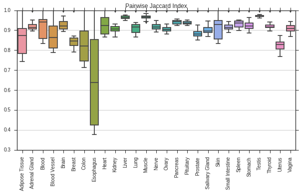
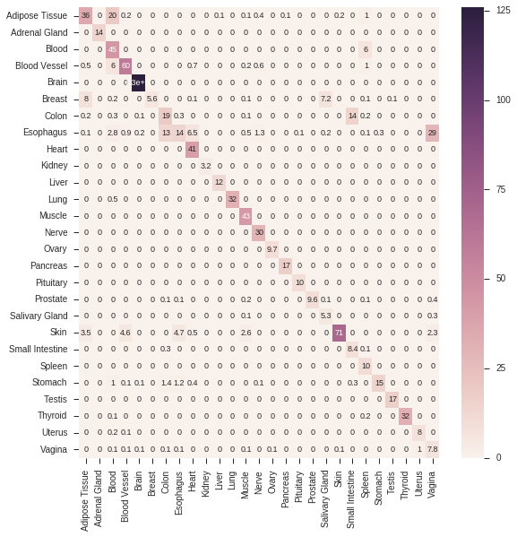
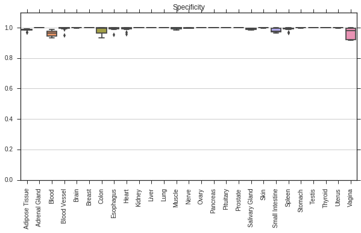
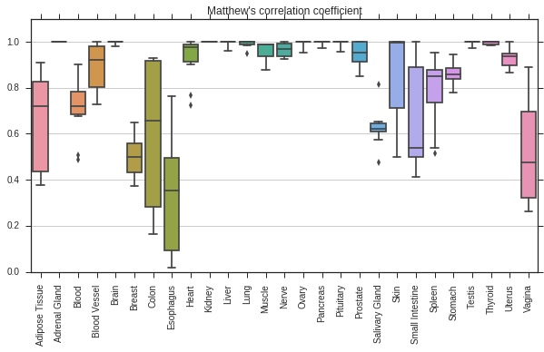

# Validating Tissue Signatures {#validating-signatures}

The authors of *BioQC* have taken three independent approaches to show that their signatures are valid and biologically meaningful. However, they did not break down the predictive performance (*i.e.* is the signature able to identify its tissue) of each signature with quantitative performance measures. 

To address this, we independently derived signatures on the [GTEx](http://gtexportal.org) dataset using *gini-index*.  and performed both a 10-fold cross validation on the same dataset and a cross-species, cross-platform validation on a different dataset. To this end, we created the python package [pygenesig](https://github.com/grst/pygenesig), a framework to create and validate signatures. 

In this chapter, we

 * perform a 10-fold cross-validation on the GTEx dataset, calculating the sensitivity, specificity and precition for each signature. 
 * perform a cross-species, cross-platform validation of the signatures generated on the GTEx dataset
 * identify a set of tissues, that can be reliably and unabmigously identified with the *BioQC* method. 


## Data
 * The [**Genotype Tissue Expression (GTEx)**](http://gtexportal.org) project is a comprehensive resource of tissue-specific gene expression data. We use this dataset to derive tissue-specific signatures. The data is human only and was generated using Illumina sequencing. 
 * We use the [**GNF Mouse GeneAtlas V3**](https://www.ncbi.nlm.nih.gov/geo/query/acc.cgi?acc=GSE10246) as a control dataset to demonstrate that the gini-method is robust over multiple platforms and species. This dataset originates from mouse and was generated using the *Affymetrix Mouse Genome 430 2.0 Array (GPL1261)*.
    
## Cross-Validation of signatures on the GTEx dataset 


```python
import sys

%load_ext autoreload
%autoreload 1
%aimport pygenesig.validation
%aimport pygenesig.gini
%aimport pygenesig.bioqc
%aimport pygenesig.tools
%aimport pygenesig.perfmeasures
%matplotlib inline

from pygenesig.validation import * 
from pygenesig.gini import * 
from pygenesig.bioqc import * 
from pygenesig.tools import * 
import pygenesig.perfmeasures as pm
import numpy as np
import pandas as pd
import sklearn.metrics as skm 
import os.path
import dask
from distributed import Client, progress
import dask.async
import dask.diagnostics

import seaborn as sns
sns.set_style("ticks", {"axes.grid" : True})
from pylab import * 
```

We use [dask](http://dask.readthedocs.io/en/latest/) for parallel execution of the cross-validation:


```python
c = Client("10.114.185.14:8786")
```

We load the preprocessed GTEx dataset. The preprocessing steps are described in [this notebook](https://github.com/grst/pygenesig/blob/3e290600b804564332b7fdff6cd572d367a04db6/notebooks/prepare_gtex_data.ipynb). 


```python
expr_file = "../data/gtex/exprs.npy"
target_file = "../data/gtex/target.csv"
splitter = sklearn.model_selection.StratifiedKFold(n_splits=10)
signature_generator = GiniSignatureGenerator
signature_tester = BioQCSignatureTester
```

Use the automated cross-validation procedure from [pygenesig](https://github.com/grst/pygenesig):


```python
sig_list, res_list = cross_validate_signatures(expr_file, target_file, signature_generator, signature_tester, splitter)
```


```python
sig_f, res_f = c.compute([sig_list, res_list], sync=False)
```


```python
progress([sig_f, res_f])
```

Obtain the signatures and confusion matrices from the dask workers: 


```python
signatures = sig_f.result()
cms = res_f.result()
```

### Signature overlap between the folds
The box-plot shows the overlap of the signatures between the different folds. A high jaccard index indicates stability of the signatures between the folds. 


```python
pairwise_jaccard = pairwise_jaccard_ind(signatures)
```


```python
fig, ax = subplots(figsize=(10,5))
data=pd.DataFrame(pairwise_jaccard)
sns.boxplot(data=data, ax=ax)
ax.set_title("Pairwise Jaccard Index")
ax.set_xticklabels(data.columns, rotation=90);
```





### Confusion Matrix
The confusion matrix shows which tissues tend to be *confused* with others. For example, we can see that it is difficult to differntiate between *colon* and *small intestine*. 

The confusion matrix below shows the average counts over the 10 folds per tissue. That means the matrix is not corrected for the number of samples per tissue. 


```python
conf_mat_mean = np.mean(np.array(cms), axis=0)
```


```python
sig_labels = BioQCSignatureTester.sort_signatures(signatures[0])
```


```python
fig, ax = subplots(figsize=(9, 9))
sns.heatmap(conf_mat_mean, ax=ax, xticklabels=sig_labels, yticklabels=sig_labels, annot=True,annot_kws={"size": 9});
```





### Performance Measures per Tissue
Below, we show the Sensitiviy, Specificity and Matthews Correlation Coefficient for the different tissues. 


```python
sens = performance_per_tissue(cms, sig_labels, pm.sens)
spec = performance_per_tissue(cms, sig_labels, pm.spec)
prec = performance_per_tissue(cms, sig_labels, pm.prec_pos)
mcc = performance_per_tissue(cms, sig_labels, pm.mcc)
```


```python
fig, ax = subplots(figsize=(10,5))
data=pd.DataFrame(sens)
sns.boxplot(data=data, ax=ax)
ax.set_title("Sensitivity")
ax.set_xticklabels(data.columns, rotation=90);
ax.set_ylim((0, 1.1));
```


```python
fig, ax = subplots(figsize=(10,5))
data=pd.DataFrame(prec)
sns.boxplot(data=data, ax=ax)
ax.set_title("Precision")
ax.set_xticklabels(data.columns, rotation=90);
ax.set_ylim((0, 1.1));
```


```python
fig, ax = subplots(figsize=(10,5))
data=pd.DataFrame(spec)
sns.boxplot(data=data, ax=ax)
ax.set_title("Specificity")
ax.set_xticklabels(data.columns, rotation=90);
ax.set_ylim((0, 1.1));
```





```python
fig, ax = subplots(figsize=(10,5))
data=pd.DataFrame(mcc)
sns.boxplot(data=data, ax=ax)
ax.set_title("Matthew's correlation coefficient")
ax.set_xticklabels(data.columns, rotation=90);
ax.set_ylim((0, 1.1));
```





**Average Performance:**


```python
np.mean(list(mcc.values()))
```


    0.84104652927756762


```python

```

## Cross-species Cross-platform validation on mouse


```python
import sys
sys.path.append("..")

%load_ext autoreload
%autoreload 1
%aimport pygenesig.validation
%aimport pygenesig.gini
%aimport pygenesig.bioqc
%aimport pygenesig.perfmeasures
%matplotlib inline

from pygenesig.validation import * 
from pygenesig.gini import * 
from pygenesig.bioqc import * 
import pygenesig.perfmeasures as pm
import numpy as np
import pandas as pd
from IPython.display import display

import seaborn as sns
from pylab import * 
```

We load the preprocessed GTEx dataset. The preprocessing steps are described in [this notebook](https://github.com/grst/pygenesig/blob/3e290600b804564332b7fdff6cd572d367a04db6/notebooks/prepare_gtex_data.ipynb). 


```python
expr = np.load("../data/gtex/exprs.npy")
target = np.genfromtxt("../data/gtex/target.csv", delimiter=",", dtype=str)
gene_symbols = pd.read_csv("../data/gtex/gene_symbols.csv", delimiter=",", dtype=str, header=None)
gene_symbols.columns = ['ensemble', 'hgnc']
```

We load the GNF mouse dataset:


```python
human_to_mouse = pd.read_csv("../data/mouseGNF/map_orthologoues.tsv", delimiter="\t")
human_to_mouse['rowname'] = human_to_mouse.index
mouse_expr = pd.read_csv("../data/mouseGNF/mouseGNF-signalMatrix.gct", delimiter="\t", skiprows=2)
mouse_pdata = pd.read_csv("../data/mouseGNF/mouseGNF-phenoData.txt", delimiter="\t")
```


```python
mouse_target = mouse_pdata.loc[~mouse_pdata["GEO.source.name"].isnull(), "GEO.source.name"].apply(
    lambda x: "_".join(x.split("_")[:-1]))
```


```python
mouse_expr = mouse_expr.iloc[:, 2:]  # remove description and id
mouse_expr = mouse_expr.values
```


```python
mouse_expr = mouse_expr[:, mouse_target.index] # select samples with tissue annotation. 
mouse_target = np.array(mouse_target)
```

#### Translation of signatures
The signatures consist of the row indices of the expression matrix they were generated on. 
We therefore need to translate the signatures from the human dataset to the mouse dataset. 

This is done in the following way: 

* GTEx indices $\to$ human gene symbols $\to$ mouse orthologous gene symbols $\to$ mouseGNF indices


```python
translation_df = pd.merge(gene_symbols, human_to_mouse, how='inner', left_on='hgnc', right_on='GeneSymbol')
translation_df.set_index('hgnc', inplace=True)
```


```python
def translate_signatures(signatures_origin):
    st = {}
    gene_symbol_list = list(gene_symbols.hgnc)
    for tissue, genes in signatures_origin.items():
        st[tissue] = []
        for g in genes:
            gene_symbol = gene_symbol_list[g]
            try: 
                rownames = pd.Series(translation_df.loc[gene_symbol, "rowname"])
                st[tissue].extend(list(rownames))
            except KeyError:
                pass
    return st    
```


```python
have_orthologue = unique(pd.merge(gene_symbols, translation_df, left_on='hgnc', right_index=True).index)
```

### Make Signatures


```python
sg = GiniSignatureGenerator(expr[:, :], target)
```


```python
signatures = sg.mk_signatures(np.array(list(range(len(target)))))
```


```python
signatures_mouse = translate_signatures(signatures)
```

### Test Signatures


```python
st = BioQCSignatureTester(mouse_expr, mouse_target)
```


```python
actual, predicted = st.test_signatures(signatures_mouse, np.array(list(range(len(mouse_target)))), return_labels=True)
```


```python
result = pd.DataFrame({"actual" : actual, "predicted" : predicted})
```


```python
confmat = pd.crosstab(result.actual, result.predicted)
```


```python
sig_labels = st.sort_signatures(signatures)
```

The resulting heatmap demonstrates that the signatures we identified as 'robust' in the corss-validation procedure do work across multiple species and multiple experimental platforms: 


```python
fig, ax = subplots(figsize=(7, 15))
sns.heatmap(confmat.as_matrix(), ax=ax, linewidths=.5, xticklabels=list(confmat.columns), yticklabels=list(confmat.index))
ax.set_xticklabels(ax.get_xticklabels(), rotation=90);
```


