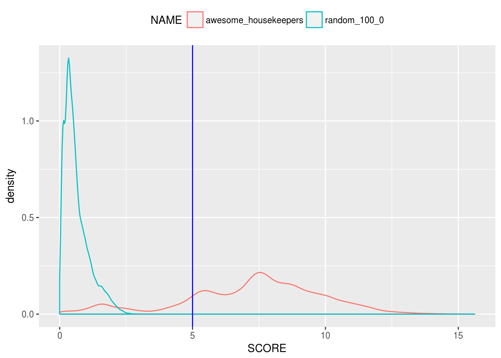

## Sample Processing with BioQC {#sample-processing}


The following processes are ressource intensive, therefore we execute them on a high performance cluster (HPC). We use [chunksub](https://github.com/grst/chunksub) to distribute the [list of sample ids](#sample-list) to the workers. This involves four major steps which are also documented in the project's [Makefile](https://github.com/grst/BioQC_GEO_analysis/blob/master/Makefile). 

1. We download the studies with [GEOquery](https://bioconductor.org/packages/release/bioc/html/GEOquery.html) and store them as R [ExpressionSet](https://bioconductor.org/packages/devel/bioc/vignettes/Biobase/inst/doc/ExpressionSetIntroduction.pdf) using the R script [geo_to_eset.R](https://github.com/grst/BioQC_GEO_analysis/blob/master/scripts/geo_to_eset.R). For some series, the download is not successful. 
2. We annotated human orthologous genes for all studies using [ribiosAnnotation](https://github.com/Accio/ribios) in [annotate_eset.R](https://github.com/grst/BioQC_GEO_analysis/blob/master/scripts/annotate_eset.R). This is necessary as the tissue signatures are built on a human dataset. The annotation failes for species which are not in the *ribios* database. 
3. We run *BioQC* on these studies use [run_bioqc.R](https://github.com/grst/BioQC_GEO_analysis/blob/master/scripts/run_bioqc.R). 
4. Finally, we prefilter BioQC's results for having a p-value < 0.05 and [import them into the database](#import-bioqc-results). 


## Sample Post-selection

The failures during download and annotation reduce the number of samples available to our study.

<!-- since there are muliple gpl and gsm in a gse, there might've been some gsm 
inserted, that don't have a tissue annotated, albeit the gse was selected. -->


```r
sql_select = "
select /*+ USE_HASH(bs, bgg) parallel(16) */ count(distinct bg.gsm) as GSM
                                           , count(distinct bgg.gse) as GSE"
sql_from = "
from bioqc_bioqc_success bs
join bioqc_gsm bg
  on bg.gsm = bs.gsm
join bioqc_gse_gsm bgg
  on bgg.gsm = bs.gsm 
"
sql_where = ""
res = dbGetQuery(mydb, str_c(sql_select, sql_from, sql_where, sep="\n"))
kable(res)
```

    GSM    GSE
-------  -----
 253210   8083


### Excluding multi-channel microarrays

Multi channel microarrays date back to the early age of gene expression studies. They don't provide absolute gene expression data and are not meaningful outside their experimental context. We therefore exclude these experiments:

```r
sql_select2 = sql_select
sql_from2 = sql_from
sql_where2 = str_c(sql_where, "where channel_count = 1", sep="\n")
res = dbGetQuery(mydb, str_c(sql_select2, sql_from2, sql_where2, sep="\n"))
kable(res)
```

    GSM    GSE
-------  -----
 235237   7561

### Exclude non-mapped tissues
We exclude samples that have a tissue annotated, but it is not mapped to a [normalized tissue](#tissue-normalization). 


```r
sql_select3 = sql_select2
sql_from3 = str_c(sql_from2, "
join bioqc_normalize_tissues bnt
  on bnt.tissue_orig = lower(bg.tissue_orig)", sep="\n")
sql_where3 = sql_where2
res = dbGetQuery(mydb, str_c(sql_select3, sql_from3, sql_where3, sep="\n"))
kable(res)
```

    GSM    GSE
-------  -----
 135670   3770

### Select organisms
We were interested in the organism distribution.

```r
sql_select4 = str_c(sql_select3, ", bg.organism_ch1", sep="\n")
sql_from4 = sql_from3
sql_where4 = sql_where3
res = dbGetQuery(mydb, str_c(sql_select4, sql_from4, sql_where4, "
group by organism_ch1
order by gsm desc", sep="\n"))
kable(res)
```


   GSM    GSE  ORGANISM_CH1                             
------  -----  -----------------------------------------
 65769   1201  Homo sapiens                             
 38096   2267  Mus musculus                             
 29909    278  Rattus norvegicus                        
  1082     24  Macaca mulatta                           
   259      7  Macaca fascicularis                      
   202      2  Mus musculus musculus x M. m. domesticus 
    80      2  Cercocebus atys                          
    57      1  Oryctolagus cuniculus                    
    36      1  Chlorocebus aethiops                     
    32      3  Mus musculus domesticus                  
    25      1  Pan troglodytes                          
    23      1  Papio cynocephalus                       
    19      1  Mus spretus                              
    18      1  Capra hircus                             
    16      1  Phodopus sungorus                        
    12      1  Mus musculus musculus x M. m. castaneus  
    12      1  Papio hamadryas                          
     8      1  Macaca nemestrina                        
     6      1  Mus musculus castaneus                   
     6      1  Mus musculus musculus                    
     3      1  Mus sp.                                  

Results suggest that it makes sense to limit the analysis to the three main organisms: *H. sapiens*, *M. musculus*, *R. norvegicus*. This makes also sense as these species are closesly related and therefore the signatures are more likely to translate within these species. 
We are left with the following amount of samples: 


```r
sql_select5 = sql_select3
sql_from5 = sql_from4
sql_where5 = str_c(sql_where4, "
  and organism_ch1 in ('Homo sapiens', 'Mus musculus', 'Rattus norvegicus')", sep="\n")
res = dbGetQuery(mydb, str_c(sql_select5, sql_from5, sql_where5, sep="\n"))
kable(res)
```

    GSM    GSE
-------  -----
 133774   3727

### Quality control

In this step we seek to identify studies on which BioQC cannot work due to poor data quality or data processing steps that remove the relative expression of a gene within a sample, e.g. per-gene normalization. 
We will first filter samples by applying a cutoff-value to statistics on the gene expression data. Second, we will use an ubiquitous signature containing housekeeping genes as an indicator if BioQC returns a sensible result on the given sample. 

On each study, we have calculated the mean of each gene over all samples. Of this series of means, we calculate the IQR. If a per-gene normalization has been applied, this value should be close to zero. This histogram shows a distribution of all IQRs over all remaining studies: 


```r
sql_select_hist = "
select /*+ USE_HASH(bs, bgg) parallel(16) */ distinct bgg.gse
                                  , study_median
                                  , abs(study_75-study_25) as IQR
"
sql_from_hist = str_c(sql_from5, "
  join bioqc_gse_gpl bgl
    on bgg.gse = bgl.gse
    and bg.gpl = bgl.gpl", sep="\n")
sql_where_hist = sql_where5


res = dbGetQuery(mydb, str_c(sql_select_hist, sql_from_hist, sql_where_hist, sep="\n"))
sm = res$IQR
hist(sm[sm > 0 & sm < 25],
     breaks=seq(0, 25, .25),
     main="Variance between gene for each study (IQR)",
     xlab="median gene expression (only values up to 25)")
abline(v=.5, col="blue")
minor.tick(nx=5)
```


We exclude all studies having a very low variance between genes (IQR < 0.5). Remaining samples:


```r
sql_select6 = sql_select3
sql_from6 = str_c(sql_from5, "
  join bioqc_gse_gpl bgl on bgg.gse = bgl.gse", sep="\n")
sql_where6 = str_c(sql_where5, "
  and abs(study_75 - study_25) >= .5", sep="\n")
res = dbGetQuery(mydb, str_c(sql_select6, sql_from6, sql_where6, sep="\n"))
kable(res)
```


   GSM    GSE
------  -----
 95591   3103

Now, we have a look at the p-value distribution of the signature we called `awesome_housekeepers` containing ubiquitous genes. The gene expression of these genes can be assumed to be more or less constant over all tissue types, therefore this signature should score high in every sample. 

**Awesome Housekeepers**


The orange curve is the pvalue distribution of the housekeeping signature. The blue curve shows the distribution of a random control signature containing 100 randomly chosen genes. 

```r
sql_select_hk = "
select /*+ USE_HASH(bs, bgg) parallel(16) */ br.signature
                                           , br.pvalue
                                           , bs.name
"
sql_from_hk = str_c(sql_from6, "
  join bioqc_res br on br.gsm = bg.gsm
  join bioqc_signatures bs on bs.id = br.signature", sep="\n")
sql_where_hk = str_c(sql_where6, "
  and br.signature in (54911, 54933) -- awesome_housekeepers, random_100_0")
res = data.table(dbGetQuery(mydb, str_c(sql_select_hk, sql_from_hk, sql_where_hk, sep="\n")))
invisible(res[,SCORE:=absLog10p(as.numeric(PVALUE))])
ggplot(res, aes(x=SCORE)) + geom_density(aes(color=NAME)) + geom_vline(xintercept = 5, color="blue") + theme(legend.position = "top")
```



We exclude all samples for which `awesome_housekeepers` scores with < 5, i.e. pvalue >= 1e-5. 

```r
sql_select7 = sql_select6
sql_from7 = str_c(sql_from6, "
  join bioqc_res br on br.gsm = bg.gsm", sep="\n")
sql_where7 = str_c(sql_where6, "
  and signature = 54911
  and pvalue < 1e-5", sep="\n")

res = dbGetQuery(mydb, str_c(sql_select7, sql_from7, sql_where7, sep="\n"))
kable(res)
```


   GSM    GSE
------  -----
 81426   2902


This is the 'background' of samples on which we test for tissue contamination. 
We store the selected samples alongside with meta information required for the analysis in the materialized view `BIOQC_SELECTED_SAMPLES` in our DBS. [Here](https://github.com/grst/BioQC_GEO_analysis/blob/master/db/views/sample_selection.sql) is the SQL script generating the materialized view. 


### Tissue abundance

The following table shows how many samples are available for each tissue: 

```r
sqlTissue = "
select /*+ parallel(16) */ tissue, count(distinct gsm) as samples from bioqc_selected_samples
group by tissue
order by samples desc"
resTissue = dbGetQuery(mydb, sqlTissue)
kable(resTissue)
```


TISSUE               SAMPLES
------------------  --------
blood                  18064
liver                  12925
lung                    7586
bone marrow             3911
kidney                  3540
breast tumor            3465
brain                   3452
heart                   2402
spleen                  2302
adipose                 2214
skin                    1927
skeletal muscle         1830
hippocampus             1573
colon                   1463
lymph node              1120
cerebellum              1094
hepatocyte              1094
tumor                   1036
breast                   795
frontal cortex           729
placenta                 678
pbmc                     665
white blood cells        664
testis                   627
retina                   596
pancreas                 586
thymus                   551
pancreatic islets        488
ovary                    455
mammary gland            395
jejunum                  380
prostate                 330
hypothalamus             271
cortex                   256
prefrontal cortex        249
uterus                   232
embryo                   217
stomach                  127
bladder                  123
cervix                    95
ventral midbrain          74
eye                       69
salivary gland            48
neuroblastoma             45
adrenal gland             39
monocyte                   6
