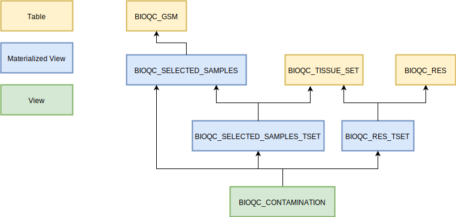

# Analyse Contamination {#contamination-analysis}

```{r setup, include=FALSE}

```

The heartpiece of the study is [this sql script](https://github.com/grst/BioQC_GEO_analysis/blob/master/db/views/contamination.sql) which identifies heterogenous samples. In this section we will go through the different analysis steps performed in the script. 

```{r, echo=FALSE}

```

## Input Tables
* **BIOQC_SELECTED_SAMPLES**: the samples resulting from the [selection process](#selecting samples) including metadata
* **BIOQC_TISSUE_SET**: the [manual mapping](#tissues-signatures) of tissues to signatures ("expected signatures")
* **BIOQC_RES**: the p-values for each sample and signature (pre-filtered for having a p-value < 0.05)

## Processing Steps explained
### BIOQC_SEL