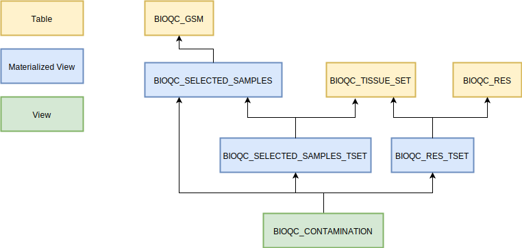

# Analyse Contamination {#contamination-analysis}


The heartpiece of the study is [this sql script](https://github.com/grst/BioQC_GEO_analysis/blob/master/db/views/contamination.sql) which identifies heterogenous samples. In this section we will go through the different analysis steps performed in the script. 

<!-- -->

## Input Tables
* `BIOQC_SELECTED_SAMPLES`: the samples resulting from the [selection process](#selecting samples) including metadata
* `BIOQC_TISSUE_SET`: the [manual mapping](#tissues-signatures) of tissues to signatures ("expected signatures")
* `BIOQC_RES`: the p-values for each sample and signature (pre-filtered for having a p-value < 0.05)

## Processing Steps explained
### BIOQC_SELECTED_SAMPLES_TSET
We join `BIOQC_SELECTED_SAMPLES` on `BIOQC_TISSUE_SET` and `BIOQC_RES` to attach the *expected tissue group* to each sample and find the highest scoring signature within each tissue group. 

Example: A sample (`GSM1234`) is annotated as 'colon tissue'. 'colon' is part of the *tissue group* 'intestine'. We search for the highest scoring signature within 'intestine' and keep it. 

The following results for `GSM1234`
```
GSM       TISSUE    TISSUE_SET   EXPECTED_SIGNATURE  PVALUE
GSM1234   colon     intestine    Colon               1e-10
GSM1234   colon     intestine    Jejunum             1e-5
```

would be aggretated into: 
```
GSM       TISSUE    TGROUP       MIN_EXP_SIG    MIN_EXP_SIG_PVALUE
GSM1234   colon     intestine    Colon          1e-5
```


### BIOQC_RES_TSET
We join the BioQC results (pvalue for each signature and sample) from `BIOQC_RES` with `BIOQC_TISSUE_SET` to map the signatures back to their tissue group. 

Example: The following results for `GSM1234`
```
GSM       SIGNATURE     PVALUE
GSM1234   Colon         1e-10
GSM1234   Intestine     1e-5
GSM1234   Liver         1e-5
```

would be aggretated into: 
```
GSM       MIN_FOUND_SIG     MIN_FOUND_PVALUE    FOUND_TGROUP  
GSM1234   Colon             1e-10               intestine
GSM1234   Liver             1e-5                liver
```

### BIOQC_CONTAMINATION
We now join the two above tables, `BIOQC_RES_TSET` and `BIOQC_SELECTED_SAMPLES_TSET`, in order to set the 'expected' and 'found' tissue groups into relation. The resulting table can be filtered by a score cutoff in order to only retrieve the siginificant entries. 

Example: The join of the above examples would look like
```
GSM       TISSUE    TGROUP      MIN_EXP_SIG   MIN_EXP_PVALUE  FOUND_TGROUP  MIN_FOUND_SIG   MIN_FOUND_PVALUE
GSM1234   colon     intestine   Colon         1e-10           intestine     Colon           1e-10
GSM1234   colon     intestine   Colon         1e-10           liver         Liver           1e-5
```


